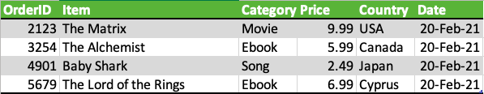

# Module 3: Build a Data Warehouse

## Module Overview
In this module, the data warehousing layer for the **SoftCart** e-commerce platform was designed, implemented, and queried using **PostgreSQL**. 

The primary objectives were to design a Star Schema Entity-Relationship Diagram (ERD), export and instantiate the DDL schema, populate dimension and fact tables with historical dataset files, and execute advanced OLAP aggregation queries (`GROUPING SETS`, `ROLLUP`, `CUBE`, and Materialized Views / MQTs) for multi-dimensional reporting.

---

## Technical Tasks & Deliverables

* **Star Schema Architecture & ERD Design:** Modeled `softcart` star schema consisting of four dimension tables (`softcartDimDate`, `softcartDimCategory`, `softcartDimItem`, `softcartDimCountry`) and a central fact table (`softcartFactSales`).
* **Database & Schema Initialization:** Created the PostgreSQL database (`Test1`) and executed DDL scripts to set up relational structures and primary key constraints.
* **Data Ingestion:** Loaded CSV raw data feeds into `DimDate`, `DimCategory`, `DimCountry`, and `FactSales` tables using PostgreSQL `\copy` routines.
* **Advanced OLAP Querying:** Authored aggregation queries leveraging `GROUPING SETS`, `ROLLUP`, and `CUBE` clauses to analyze sales volume across dimensions.
* **Materialized Query Table (MQT):** Created a refreshed Materialized View (`total_sales_per_country`) to pre-aggregate country-level metrics for high-speed reporting.

---

## Directory Structure

```text
    module-3-data-warehouse/
    ├── README.md                   # Module documentation & execution steps
    ├── erd_export.sql              # Exported DDL script from ERD design
    ├── CREATE_SCRIPT.sql           # Database setup script for Dim & Fact tables
    ├── data/                       # Dataset files for table ingestion
    │   ├── DimDate.sql
    │   ├── DimCategory.sql
    │   ├── DimCountry.sql
    │   └── FactSales.sql
    ├── img/                        # Screenshot of ERD and sample data
    │   ├── erd.PNG
    │   ├── sample.PNG
    └── sql_queries.sql             # OLAP aggregation queries (GROUPING SETS, ROLLUP, CUBE, MQT)
```

---

### Step 0: Star Schema ERD Design
Here is the sample data that the company sent me:


From the sample data, I'm able to design a Star Schema for the warehouse by identifying the columns for the various dimension and fact tables in the schema. Here are the specifications:

* **softcartDimDate**: Granularity down to a day (`dateid`, `date`, `year`, `quarter`, `month`, `monthname`, `day`, `weekday`).

* **softcartDimCategory**: Category entities (`categoryid`, `category`).

* **softcartDimItem**: Product item entities (`itemid`, `item`).

* **softcartDimCountry**: Geographic entities (`countryid`, `country`).

* **softcartFactSales**: Core transactions (`orderid`, `dateid`, `categoryid`, `itemid`, `countryid`, `price`).

Then I proceed to use the ERD tool in PostgreSQL to make the ERD diagram:


---

### Step 1: Server Connection & Table Creation

Connect to PostgreSQL, create the target analytical database Test1, and instantiate schema tables:

* **Via Command Line / psql:**
  Run `mongoimport` directly from your terminal:
  ```bash
  -- Create database
    CREATE DATABASE "Test1";

    -- Connect to Test1 database and execute Create_Script.sql
    \c Test1
    \i Create_Script.sql
  ```
* **Via pgAdmin / GUI:**

1. Open pgAdmin, right-click Databases in the left sidebar, and click Create > Database...

2. Name the database Test1 and click Save.

3. Expand Test1, open the Query Tool (top toolbar icon), open Create_Script.sql, and click Execute (F5).

---
