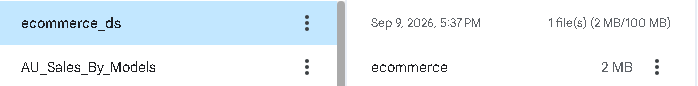
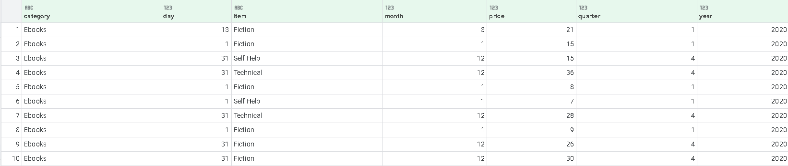
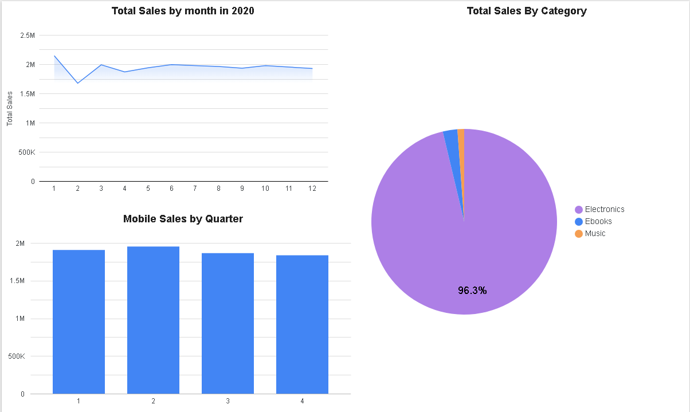

# Module 4: Data Analytics & Business Intelligence Dashboard

## Module Overview
In this module, interactive business intelligence dashboards were designed and implemented using **Google Looker Studio** for the **SoftCart** e-commerce platform. The objective was to transform raw transactional data (`ecommerce.csv`) into actionable executive metrics through line charts, pie charts, and bar charts.

---

## Technical Tasks & Deliverables

* **Data Ingestion & Connection:** Imported `ecommerce.csv` into Google Looker Studio, configured field data types, and generated a tabular data view.
* **Data Source Management:** Created and named a persistent Looker Studio Data Source (`ecommerce`) for multi-report reusability.
* **Month-wise Sales Analytics:** Configured a time-series Line Chart analyzing monthly sales trajectories across 2020.
* **Category Share Analytics:** Built a Pie Chart illustrating relative revenue contributions across product categories (`Electronics`, `Ebooks`, `Music`).
* **Quarterly Product Performance:** Constructed a Bar Chart filtering specifically for `Mobile` phone revenue aggregated across quarters Q1–Q4.

---

## Directory Structure

```text
module-4-data-analytics/
├── README.md                   # Module documentation & step-by-step guide
├── data/                       # Dataset files
│   └── ecommerce.csv           # Raw transactional data (68,003 records)
└── img/                        # Dashboard screenshots & visualizations
    ├── dataStudioLoadCSV.PNG
    ├── ecommerceTop10s.PNG
    └── looker_studio_dashboard.PNG
``` 

---

## Dashboard Creation
### Step 1: Import Data
1. Navigate to `Google Data Studio` Homepage, formerly known as `Looker Studio` (`https://datastudio.google.com`). 
2. Click `Create` > `Data Source` and choose the `CSV File Upload` connector.
3. Upload `ecommerce.csv`. Looker Studio auto-detects column headers and maps data types (price, month, quarter, year, day as Numeric; category, item as Text).
4. Click `Create Dataset` to create a datasource called `ecommerce_ds`.
5. Confirm that default aggregation for `price` is set to `SUM`.



---
### Step 2: Sample Table (First 10 Rows)
To verify data integrity, add a Table visualization to the canvas with dimensions `day`, `month`, `quarter`, `year`, `category`, `item`, and metric `price`.



---

### Step 3: Data Source Configuration and Setup Report
1. Navigate to `Google Data Studio` Homepage, formerly known as `Looker Studio` (`https://datastudio.google.com`). 
2. Click `Create` > `Report`.
3. You will be prompted to add data to report. Choose the `CSV File Upload` connector.
4. Select `ecommerce_ds` dataset and click `Add`
5. In the data source fields panel, click `+ Add a Calculated Field`.
6. Name the field `Total Sales`.
7. Input the formula:
```commandline
    SUM(price)
```
8. Click `Save and Done`.

---

### Step 4: Creating Chart
1. Add Line Chart with the following properties:
* **Title:** Total Sales by month in 2020
* **Dimension:** `month` (Sorted ascending: 1 through 12)
* **Metric:** `Total Sales` (Calculated Field, aggregated as SUM)
* **Filter:** `year` = `2020`
2. Add Pie Chart with the following properties:
* **Title:** Total Sales By Category

* **Dimension:** category

* **Metric:** Total Sales (Calculated Field)
3. Add Horizontal Bar Chart with the following properties:
* Title: Mobile Sales by Quarter

* Dimension: `quarter` (1, 2, 3, 4)

* Metric: `Total Sales` (Calculated Field)

* Chart Filter: Include `item` = `Mobile`
4. Feel free to adjust your layout. 

Here is the finished dashboard:


[<-- Previous Module](https://github.com/minhquangn2000/IBMCapStoneProject/tree/main/3%20-%20Build%20a%20Data%20Warehouse)  | [Next Module -->](https://github.com/minhquangn2000/IBMCapStoneProject/tree/main/5%20-%20ETL%20%26%20Data%20Pipelines)
