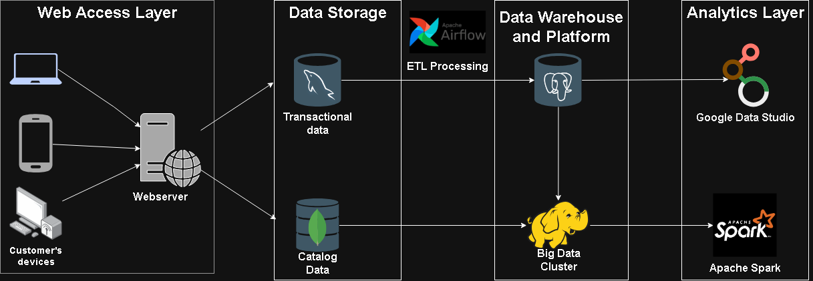

# IBM Data Engineering Capstone Project: SoftCart Data Platform

## Overview
This repository contains the end-to-end implementation of the capstone project for the **IBM Data Engineering Professional Certificate** on Coursera. 

As a **Junior Data Engineer** at **SoftCart**, I designed and built a hybrid data platform handling transactional, catalog, and web log data. The platform automates ETL pipelines using Apache Airflow, stores analytical data in PostgreSQL and Hadoop, runs distributed analytics via PySpark, and outputs operational metrics to executive dashboards.

## Key Capabilities & Features
* **Hybrid Data Architecture:** Integrates on-premises relational OLTP databases with cloud-compatible staging and storage layers.
* **Automated Data Pipelines:** Manages scheduled extraction, transformation, and loading (ETL) between transactional sources and data warehouses.
* **Big Data Analytics:** Leverages distributed processing to analyze large-scale web traffic logs and transaction histories.
* **Operational Reporting:** Exposes clean data models to business intelligence tools for real-time executive reporting.
---

## Data Lifecycle & Pipeline Flow

---

## Data Platform Architecture & Tech Stack

SoftCart utilizes a **hybrid architecture**, leveraging both on-premises infrastructure and cloud services.

| Layer / Functional Area | Technology / Tool | Description |
| :--- | :--- | :--- |
| **OLTP Database** | MySQL | Stores relational transactional data (inventory, orders, sales) |
| **NoSQL Store** | MongoDB | Stores semi-structured product catalog data |
| **Data Orchestration** | Apache Airflow | Schedules and manages automated ETL pipelines |
| **Staging Data Warehouse** | PostgreSQL | Holds extracted relational data for analytical processing |
| **Big Data Platform** | Apache Hadoop | Centralized storage for large-scale enterprise analytics data |
| **Big Data Engine** | Apache Spark | Performs distributed data processing and transformation on Hadoop |
| **Business Intelligence** |  Google Looker Studio | Visualizes operational metrics via real-time dashboards |

---

## Certificate & Acknowledgments

* **Program:** [IBM Data Engineering Professional Certificate](https://www.coursera.org/learn/data-enginering-capstone-project) hosted on Coursera.
* **Issued By:** IBM Skills Network.
* **Verified Certificate:** [Coursera Certificate](https://coursera.org/verify/YOUR_CERTIFICATE_ID)